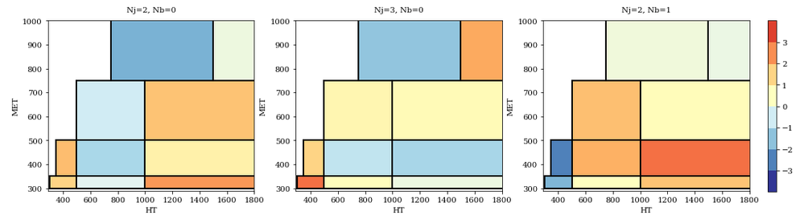
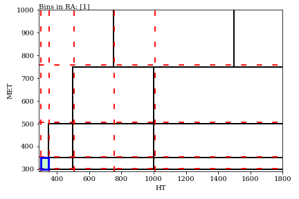

# Mining the LHC data for New Physics: Rectangular aggregation technique
Python code for the Rectangular Aggregation (RA) technique used in [arXiv:1707.05783](http://arxiv.org/abs/1707.05783) to mine the LHC dataset for hints of new physics. Based on the idea that, in the presence of a finely-binned parameter space, a signal of New Physics would populate multiple nearby bins.

It takes a *N*-dimensional parameter space over which exclusive bins are defined and generates aggregations of nearby bins into *super-bins* (rectangular aggregations, or RAs), and can then compute the (local) significance of each aggregation, which is a delta log-likelihood between the Standard Model hypothesis and the New Physics hypothesis where the signal only populates that one RA. 

Head over to the Jupyter notebook [test.ipynb](test.ipynb) to test the code with the CMS SUSY jets+MET search CMS-SUS-16-033, [link to CMS website](http://cms-results.web.cern.ch/cms-results/public-results/publications/SUS-16-033/index.html)

# summary
I will here describe the working of the algorithm in more details, in reference to the CMS search [SUS-16-033](http://cms-results.web.cern.ch/cms-results/public-results/publications/SUS-16-033/index.html). The figures have been made with the notebook [test.ipynb](test.ipynb)

For that search, the dataset is binned in 4 variables, Nj, Nb, HT and MET, namely the number of jets, the unmber of b-tagged jets, the scalar sum of the jet pT and the missing momentum magnitude.  
174 exclusive bins are defined with respect to these variables, and observed events are compared to the background expectations and their uncertainties.

The parameter space can be visualized by projecting the 4-dimensional parameter space into 2D (or 3D) slices. For example, we will here fix Nj and Nb and look at different two-dimensional HT-MET projection:

Here each rectangle is a signal region. The colors of each bin show if the data has an excess (red) or a deficit (blue), with the statistical significance quantified in number of sigmas.  
_To be precise, the **local** significance for signal in a dark red rectangle would be 3 sigmas (99.7% CL), while a dark blue rectangle has a deficit (if a BSM signal could **reduce** the number of events there, it would have a significance of 3 sigmas)_

The algorithm workings are better shown with a GIF: we scan this parameter space by taking all possible bin dividers (red dashed lines below) and making all possible rectangles (blue and green shading below). For each rectangle, a **rectangular aggregation** is defined by summing all bins overlapping with that aggregation, for which one can then finding the local significance for New Physics.

The algorithm runs *recursively* in the kinematic variables, so that it works in any dimensionality. For this CMS search, we looked at the full four-dimensional dataset, which results in 13,000 distinct aggregations, from the 174 individual signal regions  (note that we stop the GIF after 20 iterations).

This is now a **model-independent** search for New Physics. It is basically a N-dimensional bump-hunt. *Effectively, this method is now testing thousands of signal hypotheses, which would each populate a (small or large) neighboring subset of signal regions.*

Head over to the [jupyter notebook](test.ipynb) to test the method.  You can also check one of the many talks given on this method and of the interesting excesses found:

<embed src="talk_CIPANP.pdf#view=FitH" width="100%" type='application/pdf'> 

